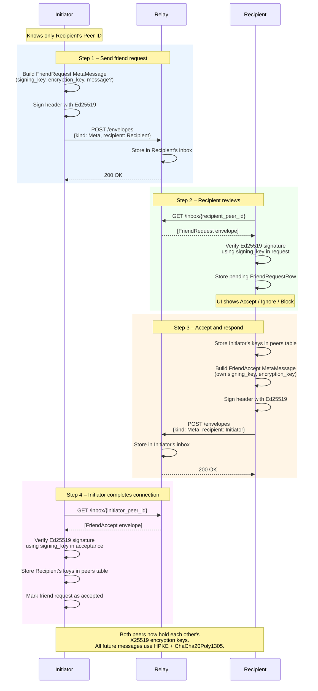
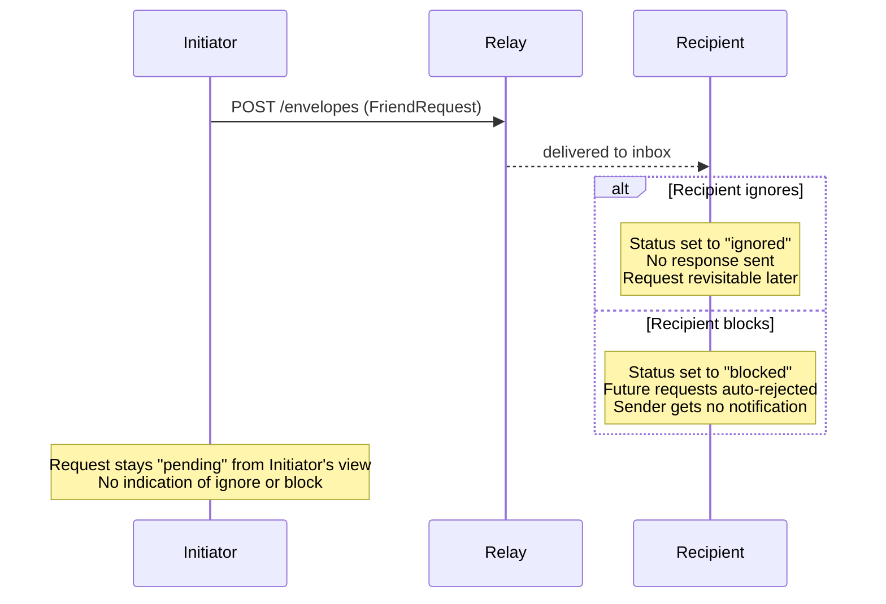

# Flow: Add Friend (Key Exchange Handshake)

Adding a friend establishes a mutual cryptographic relationship. Both peers
exchange their long-term signing and encryption public keys so that future
messages can be authenticated and end-to-end encrypted.

The initial request is sent **in plaintext** because the initiator does not yet
have the recipient's encryption key. After the handshake both peers have each
other's X25519 encryption keys and can use HPKE for all subsequent messages.

See [friend_requests.md](../friend_requests.md) for the full security analysis.

## Happy Path

## Block / Ignore Variants

## Security Notes

| Property | Detail |
|---|---|
| Friend request content | **Plaintext** — relay can see who is friending whom |
| Public key trust | TOFU (Trust on First Use) — recipient trusts keys in the request |
| Peer ID binding | `SHA-256(signing_public_key)` — cannot forge a matching key |
| Post-handshake messages | HPKE-encrypted — relay cannot read content |
