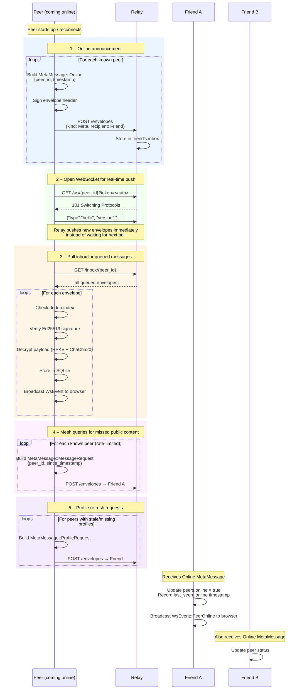
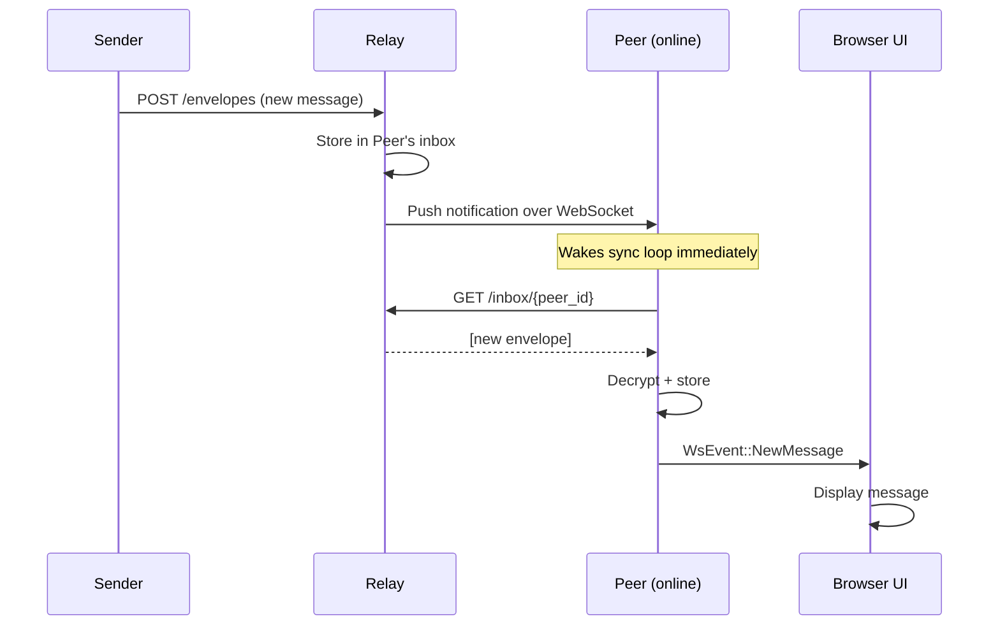

# Flow: Peer Reconnect

When a peer comes back online (after a restart or a period of being offline) it
performs several actions to re-join the network: it announces its presence to
known peers, fetches any queued messages from the relay, and issues mesh queries
to catch up on public content it may have missed.

## Startup Sequence

## WebSocket-Accelerated Delivery

The relay WebSocket connection (`/ws/{peer_id}`) allows near-real-time message
delivery without waiting for the next polling interval.

## Sync Loop Backoff

If the relay is unreachable the sync loop backs off exponentially (30 s, 60 s,
120 s … up to 5 minutes). Once reconnected it broadcasts
`WsEvent::RelayStatus { connected: true }` to update the browser UI.
