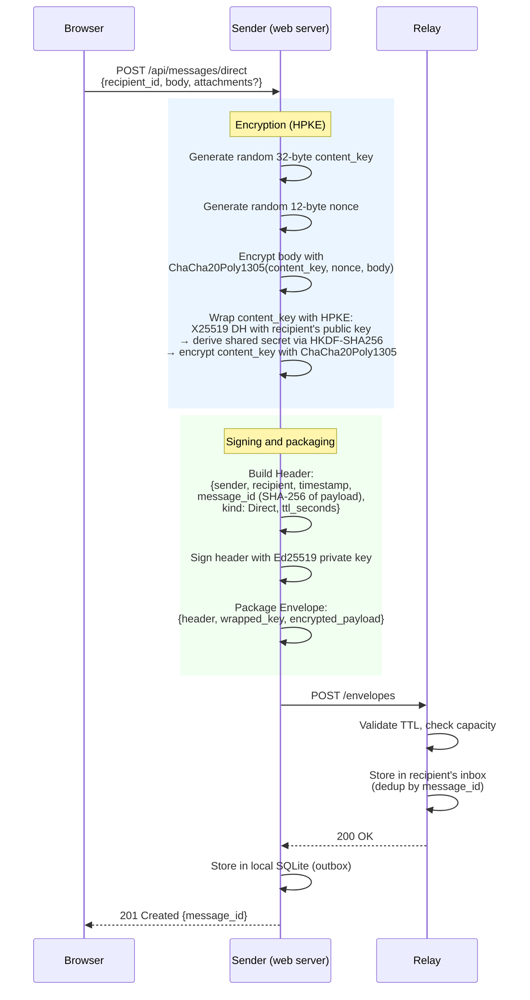
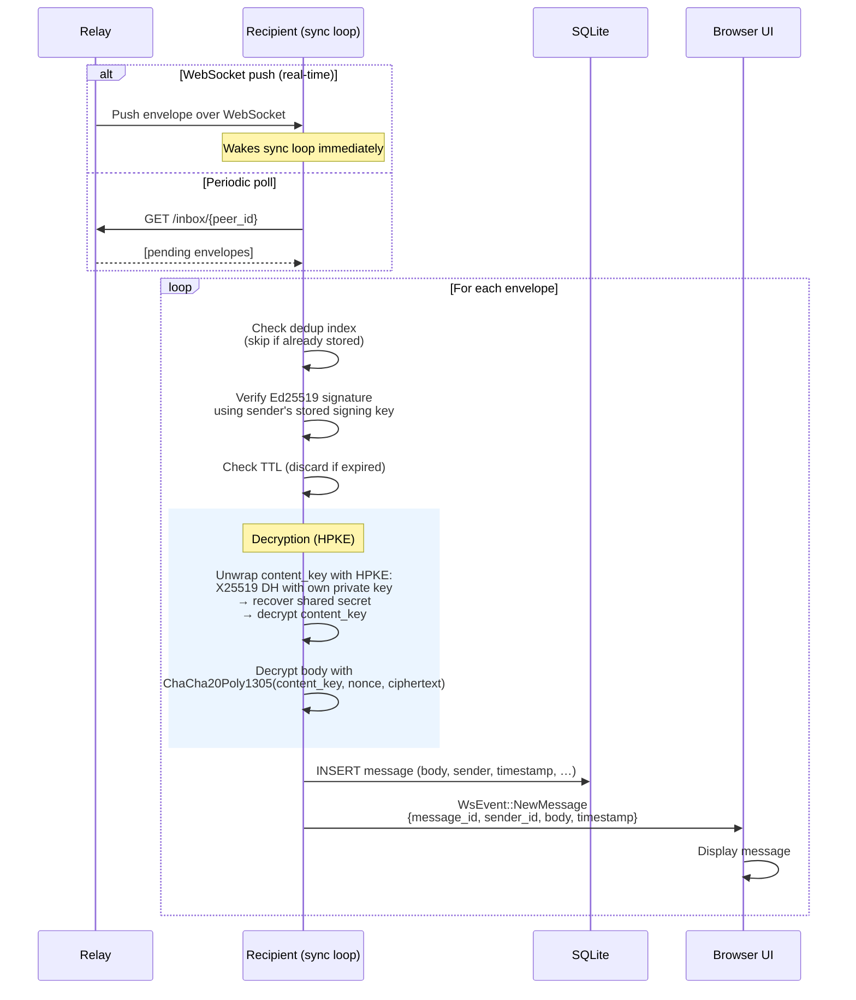

# Flow: Direct Message

Direct messages are end-to-end encrypted using HPKE (Hybrid Public Key
Encryption). Each message gets a fresh random content key so that compromising
one message does not expose others. The relay handles opaque encrypted blobs and
never has access to plaintext.

Both peers must have completed the [friend request handshake](01-add-friend.md)
before sending encrypted direct messages, because the sender needs the
recipient's X25519 encryption public key.

## Sending

## Receiving

## Cryptographic Properties

| Property | Mechanism |
|---|---|
| Confidentiality | HPKE (X25519-HKDF-SHA256 + ChaCha20Poly1305) |
| Integrity | Ed25519 signature on header |
| Per-message forward secrecy | Fresh random `content_key` per message |
| Content addressing | `message_id = SHA-256(payload_bytes)` |
| Replay prevention | Dedup index + TTL enforcement |
| Relay sees | sender ID, recipient ID, timestamp, message size |
| Relay cannot see | message body, content_key, or any plaintext |
