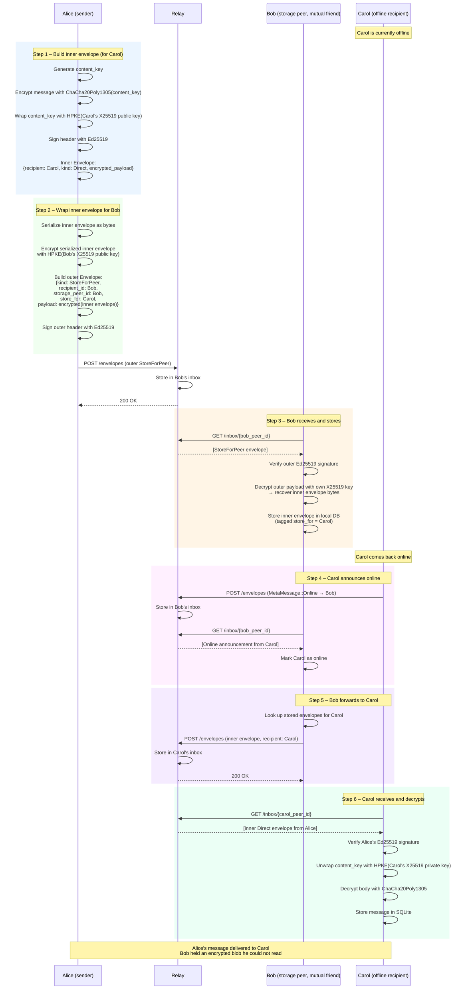

# Flow: Store-and-Forward Direct Message

When the intended recipient is offline and no relay is available to hold
messages long enough, a sender can route a message through a **mutual friend**
who stores it until the recipient reconnects.

The outer envelope is encrypted for the storage peer (who unwraps and holds it),
while the inner envelope is encrypted for the final recipient (who decrypts and
reads it). The storage peer never sees the message content.

See [architecture.md § Peer Store-and-Forward](../architecture.md#peer-store-and-forward)
for design context.

## Message Routing via Storage Peer

## Privacy Properties

| Question | Answer |
|---|---|
| Can Bob read Alice's message to Carol? | No — inner envelope is encrypted for Carol only |
| Can the relay read any content? | No — both envelopes are HPKE-encrypted |
| Does Carol learn that Bob was the storage peer? | Yes, via the `storage_peer_id` field in the outer header |
| Does the relay know Carol is the final recipient? | Yes — `store_for` field is visible in the outer header |
