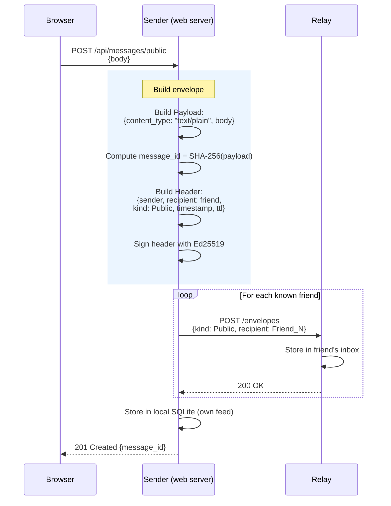
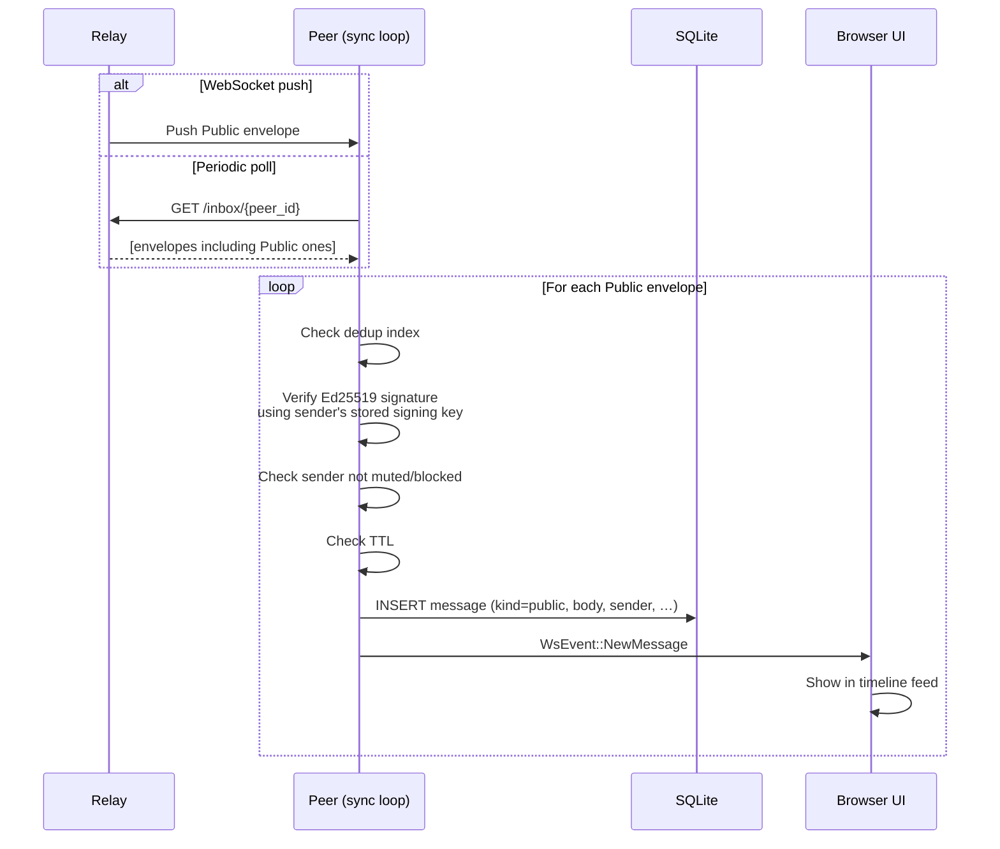

# Flow: Public Message

Public messages are timeline posts visible to peers who follow the author.
Unlike direct messages they are **not HPKE-encrypted** (they are public by
intent), but the header is still Ed25519-signed so recipients can verify
authenticity.

Public messages are distributed in two ways:
1. **Direct delivery** — posted to each known friend's inbox at send time.
2. **Mesh backfill** — peers share messages with each other on reconnect; see
   [mesh-distribution.md](07-mesh-distribution.md).

## Sending a Public Post

## Receiving a Public Post

## Notes

- Public message bodies are stored as plaintext in SQLite on the recipient's
  device.
- If the sender's signing key is not yet known (e.g. message arrived via mesh
  from a non-friend), signature verification is deferred until the key is
  obtained (see [peer-discovery.md](08-peer-discovery.md)).
- Peers that the author does not know about will only receive public messages
  via the [mesh distribution](07-mesh-distribution.md) protocol.
