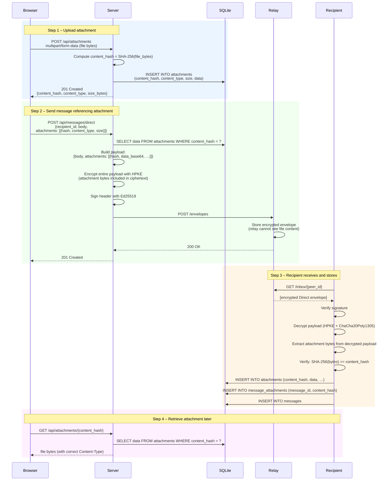
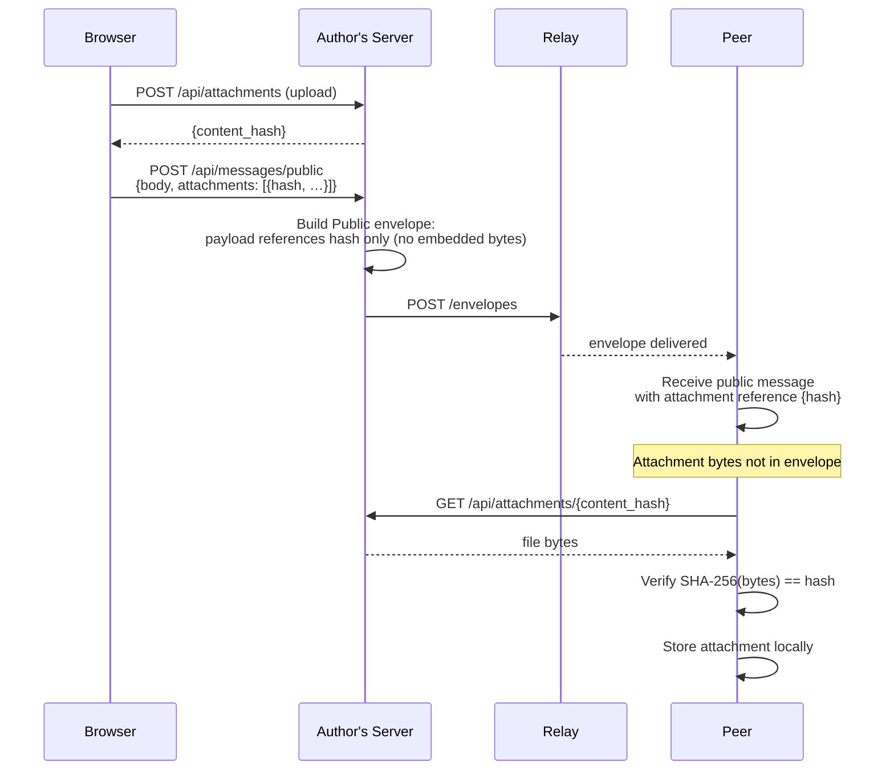

# Flow: Attachments

Attachments are stored using **content addressing**: the storage key is the
SHA-256 hash of the file bytes, so identical files are stored only once and
hashes double as integrity proofs.

For **direct and group messages**, attachment bytes are base64-encoded and
embedded directly in the encrypted payload — the relay never sees the file
content. For **public messages**, attachments travel as plaintext references
that any recipient can fetch by hash.

## Upload and Send (Direct Message with Attachment)

## Public Message with Attachment

For public messages, attachments are referenced by hash but **not embedded** in
the envelope. Recipients fetch the attachment separately from the original
sender or a peer who has it.

## Content Addressing Properties

| Property | Detail |
|---|---|
| Deduplication | Same file uploaded multiple times stores only once |
| Integrity | `SHA-256(bytes) == content_hash` verified on receive |
| Privacy (Direct) | Attachment bytes are inside the HPKE ciphertext |
| Privacy (Public) | Attachment bytes are fetched in plaintext from sender |
| Relay visibility | For Direct messages: none (hash is in encrypted header) |
