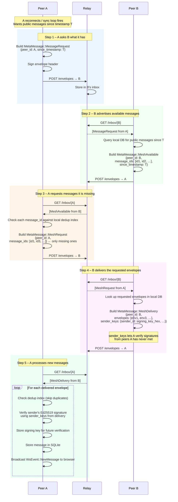
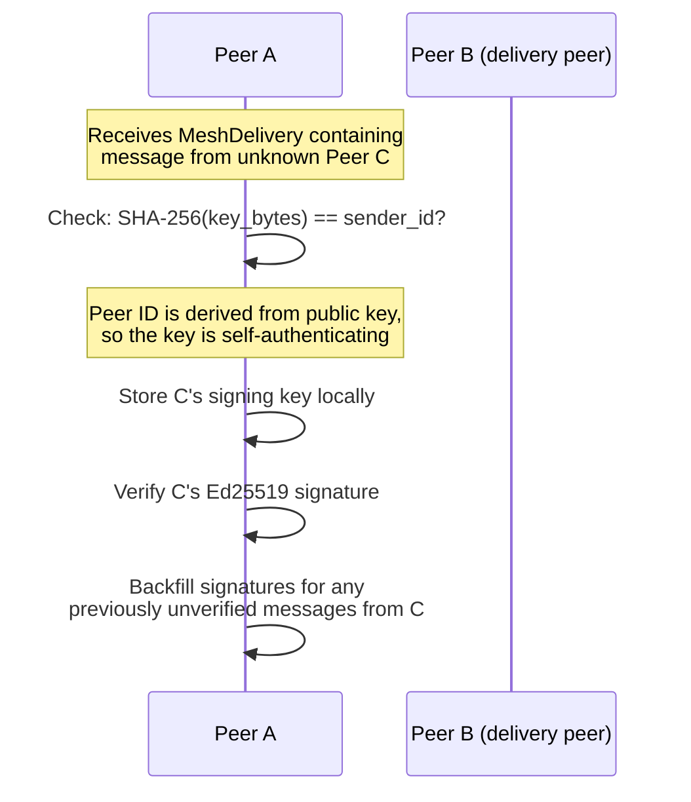

# Flow: Mesh Distribution of Past Public Messages

Peers share public messages they have seen with each other using a
four-message gossip protocol. This allows a peer to catch up on content it
missed while offline and to receive posts from peers it is not directly
connected to.

The protocol is rate-limited per peer: queries are only sent at most once per
`MESH_QUERY_INTERVAL_SECS` interval.

## Four-Way Gossip Handshake

## Backfilling Signatures

When a message arrives via mesh from a peer A has never added as a friend,
A has no stored signing key for that sender. The `sender_keys` map in
`MeshDelivery` solves this:

## Scope and Rate Limiting

- Mesh queries use `DEFAULT_MESH_WINDOW_SECS` (e.g. 24 h) as the lookback window.
- Each peer is queried at most once per `MESH_QUERY_INTERVAL_SECS`.
- Only **public** messages are shared via mesh; direct and group messages are
  not included in `MeshDelivery`.
- A peer that has no new messages simply sends `MeshAvailable` with an empty
  list, and A sends no `MeshRequest`.
