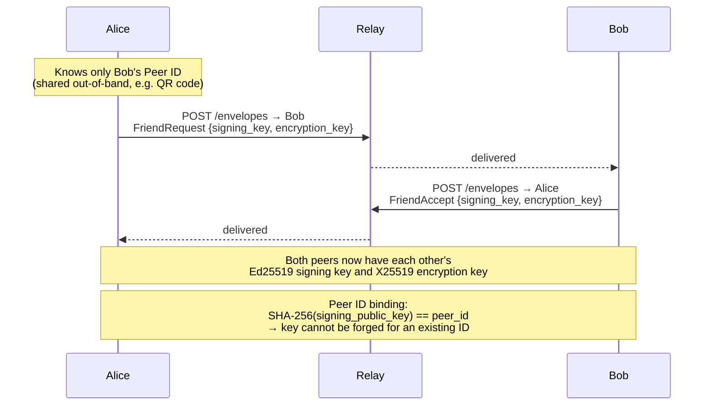
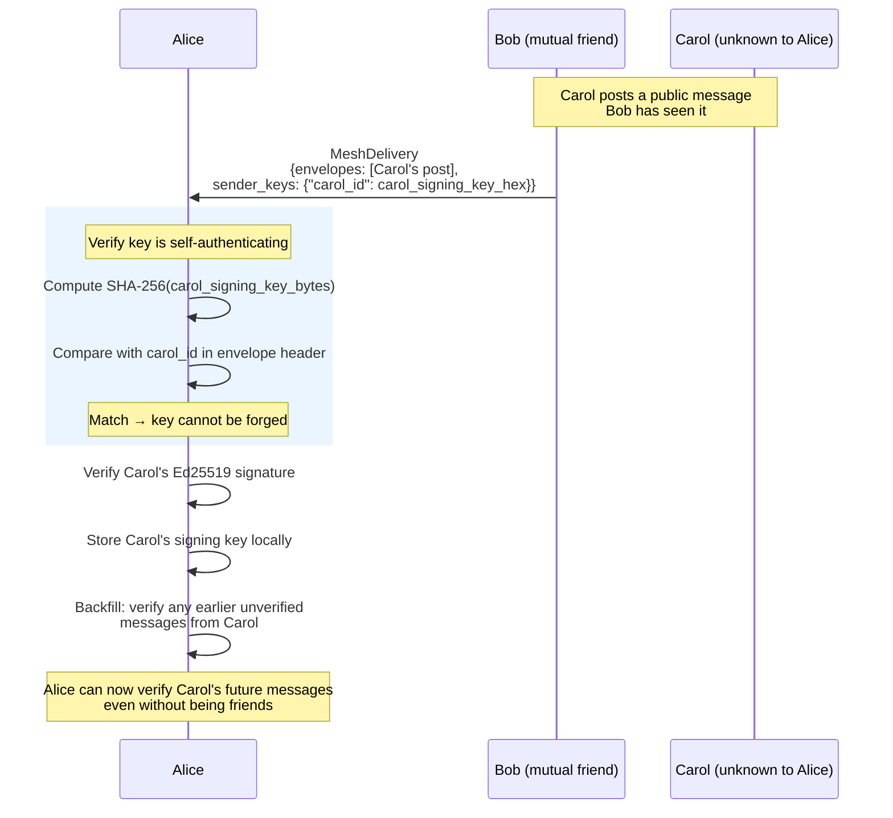
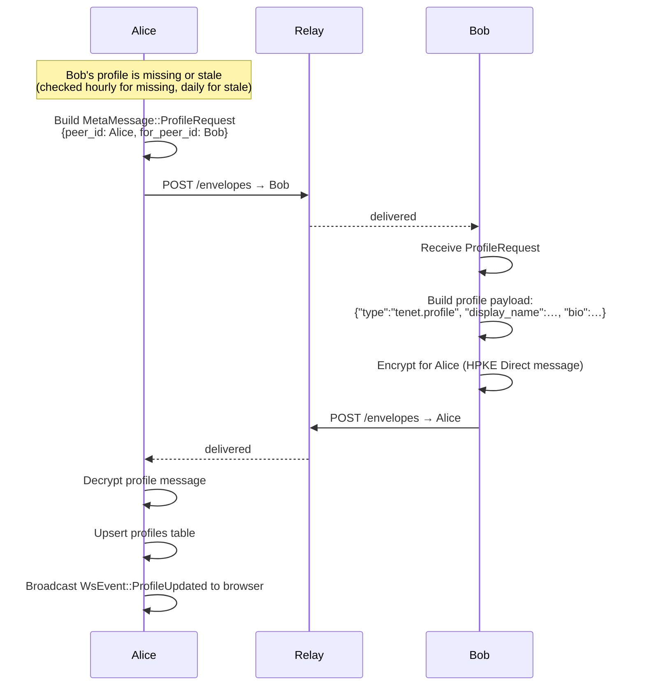
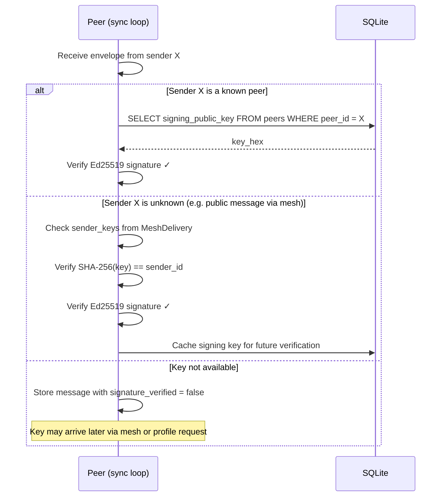

# Flow: Peer Discovery and Public Key Fetching

Tenet uses a **Trust on First Use (TOFU)** model. Peers learn each other's
public keys through explicit handshakes or via the mesh delivery protocol.
There is no global key directory — key distribution is decentralised.

## How Peers Learn Each Other's Keys

There are three paths to obtaining a peer's public keys:

| Path | When used |
|---|---|
| Friend request handshake | Adding a new friend directly |
| Mesh delivery (`sender_keys`) | Receiving posts from peers of peers |
| Profile request / response | Refreshing or fetching profile data |

## Path 1: Friend Request (Direct Key Exchange)

The [friend request flow](01-add-friend.md) is the primary key exchange
mechanism. Keys are embedded in the plaintext `FriendRequest` and `FriendAccept`
meta messages.

## Path 2: Mesh Delivery (Keys from Unknown Peers)

When a peer receives messages via [mesh distribution](07-mesh-distribution.md)
from someone it has never met, the delivering peer includes a `sender_keys` map
so the receiver can verify signatures.

## Path 3: Profile Request

## Signature Verification on Receive

Every received envelope is checked against the sender's known signing key.

## Key Binding Guarantee

The Peer ID is `SHA-256(signing_public_key)`. Because SHA-256 is
preimage-resistant, an attacker cannot manufacture a signing key that hashes to
an existing Peer ID. Possessing a valid signature proves ownership of the
corresponding private key.
