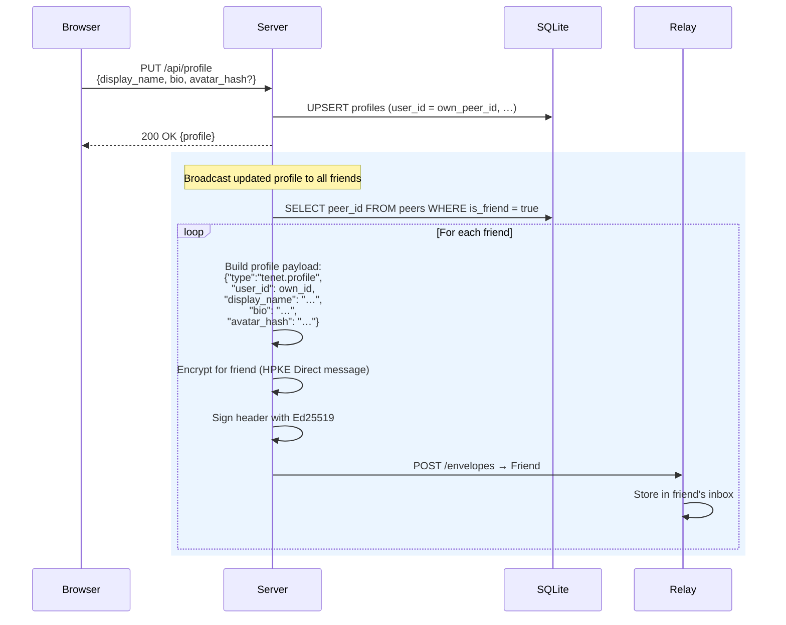
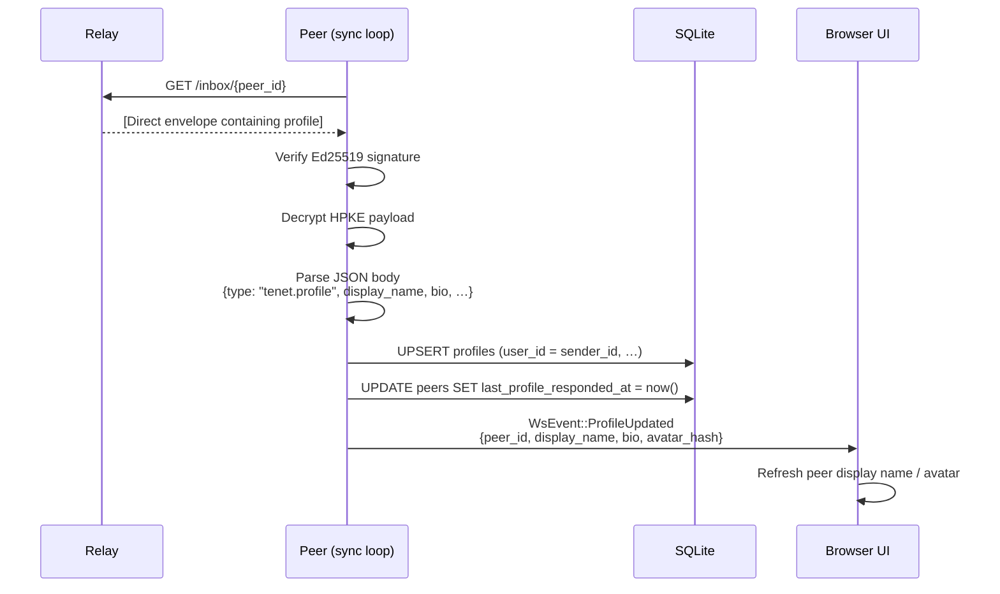
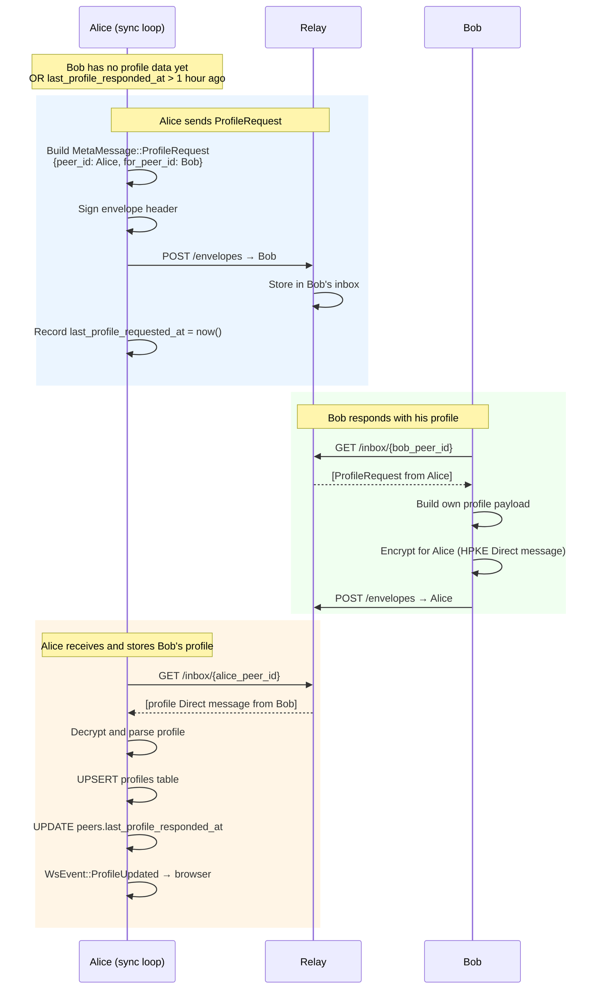

# Flow: Profile Updates

Each peer maintains a profile (display name, bio, avatar hash). Profiles are
distributed to friends either **proactively** when a user updates their own
profile, or **reactively** in response to a `ProfileRequest` from another peer.

Profile data is sent as an encrypted Direct message so only the intended
recipient can read it.

## Push: Updating Your Own Profile



## Receive: Incoming Profile Update



## Pull: Requesting a Peer's Profile

Profiles are also requested automatically by the background sync loop for peers
whose profile is missing or stale (hourly for missing, daily for stale).



## Manual Profile Request

A user can also manually request a peer's profile from the web UI:

```
POST /api/peers/{peer_id}/request-profile
```

This sends an immediate `ProfileRequest` MetaMessage regardless of the
rate-limit timers.

## Profile Data Fields

| Field | Description |
|---|---|
| `display_name` | Human-readable name shown in the UI |
| `bio` | Short description / status text |
| `avatar_hash` | SHA-256 content hash of an avatar image attachment |
| `user_id` | Peer ID of the profile owner (for attribution) |
