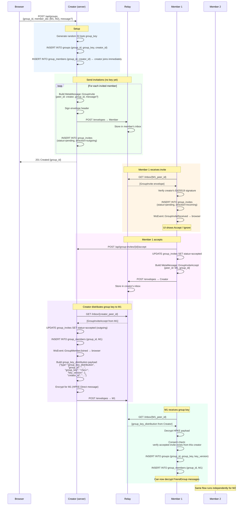
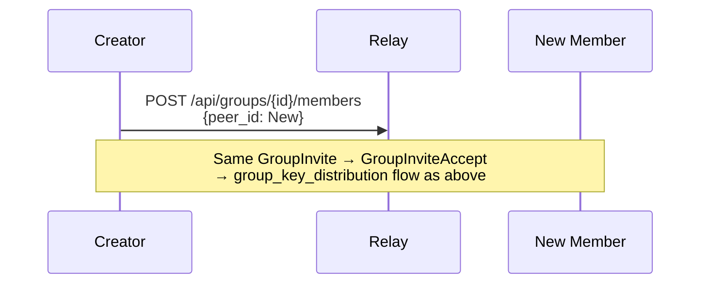
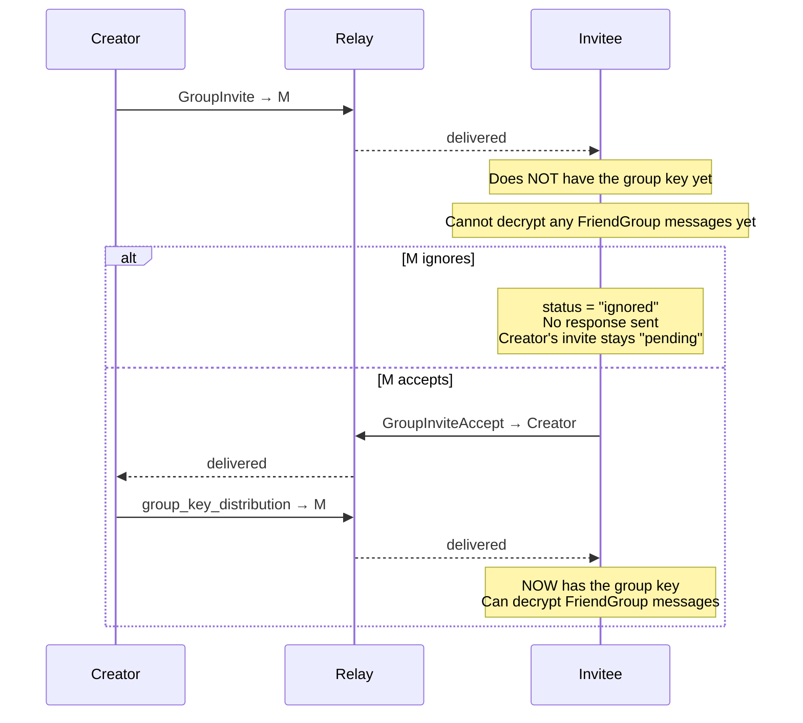

# Flow: Group Creation and Invite

Groups share a 32-byte symmetric key. The creator generates the key and
distributes it to each member **after** they explicitly accept an invitation.
This consent model ensures no peer receives a group key without agreeing to join.

See [groups.md](../groups.md) for REST API reference and schema details.

## Creating a Group and Inviting Members

## Adding a Member Later

## Consent Model

