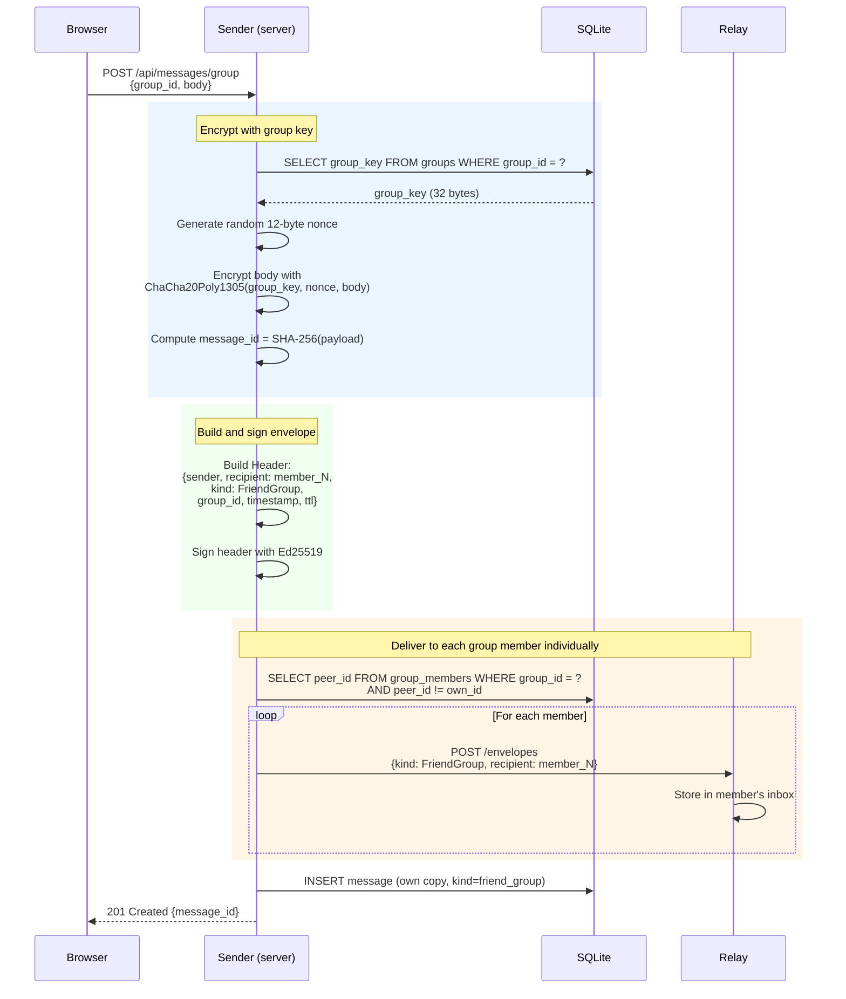
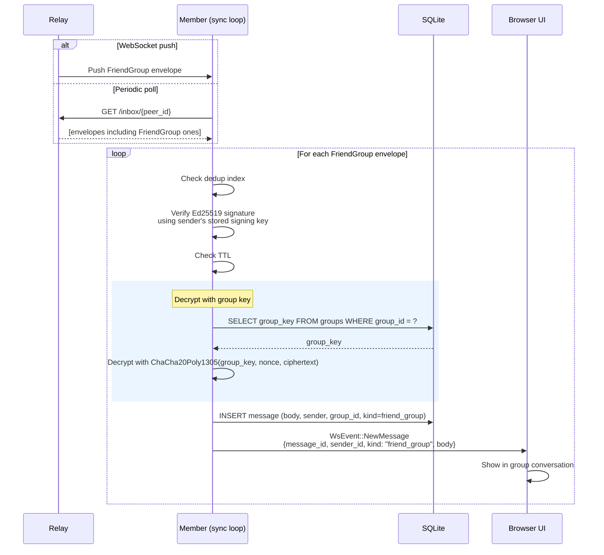
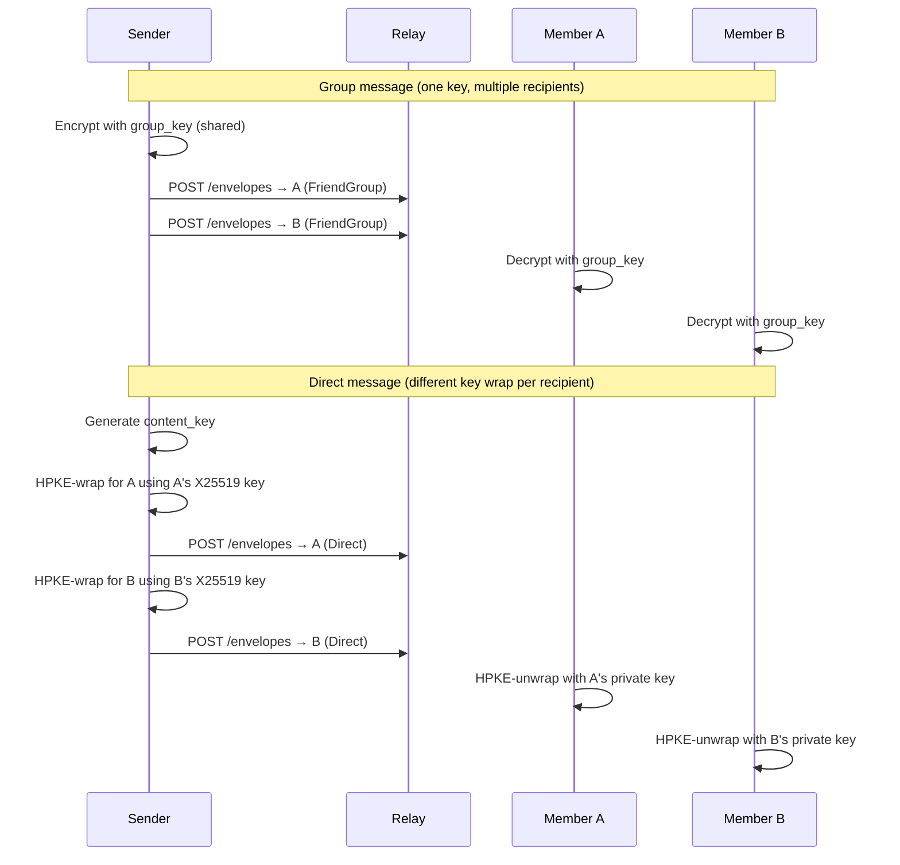

# Flow: Group Message

Once a member holds the group's symmetric key they can send and receive group
messages. Unlike direct messages which use HPKE per-recipient wrapping, group
messages use **a single ChaCha20Poly1305 symmetric key** shared by all members.
Every member uses the same key to decrypt.

See [group-create-invite.md](10-group-create-invite.md) for how the key is
established, and [groups.md](../groups.md) for the full API reference.

## Sending a Group Message

## Receiving a Group Message

## Comparison: Group vs Direct Encryption

## Known Limitations

- **No key rotation on member removal**: removing a member from the group does
  not generate a new group key. The removed member retains their copy of the
  old key and can decrypt past (and future) messages if they store them.
- **One group key per group**: all messages use the same key regardless of
  when a member joined. A member who joins later and receives the current key
  could theoretically decrypt past messages if they obtain old ciphertext.
