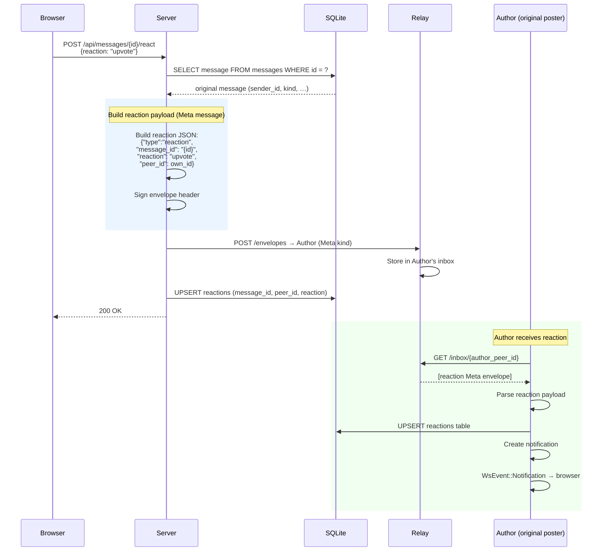
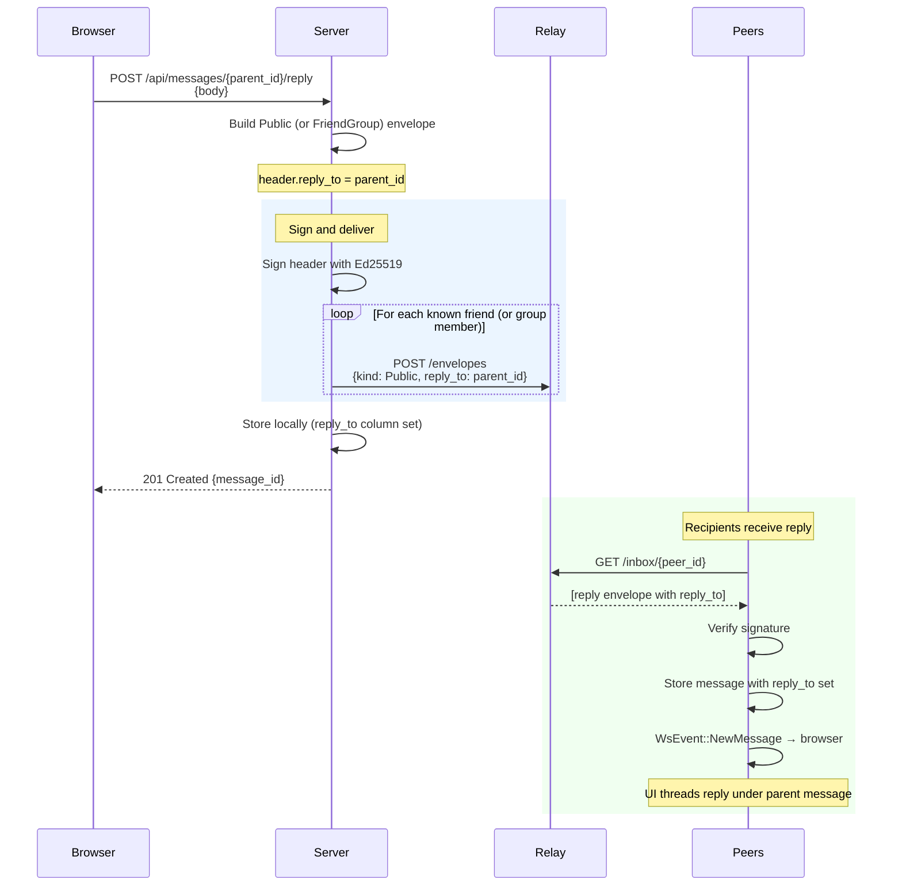
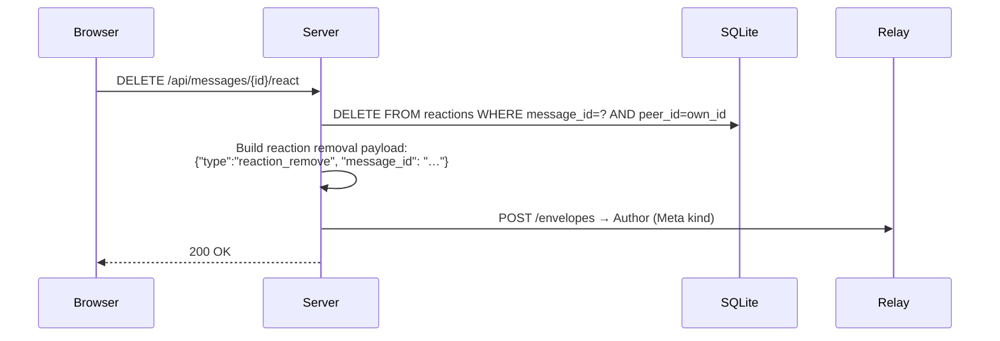

# Flow: Reactions and Replies

Reactions (upvote / downvote) and threaded replies extend public and group
messages. Both are delivered via the relay like any other envelope and reference
the original message by its `message_id`.

## Reactions

## Threaded Replies

Replies reference the parent message via the `reply_to` field in the envelope
header. They are otherwise sent and received like regular public or group
messages.

## Removing a Reaction

