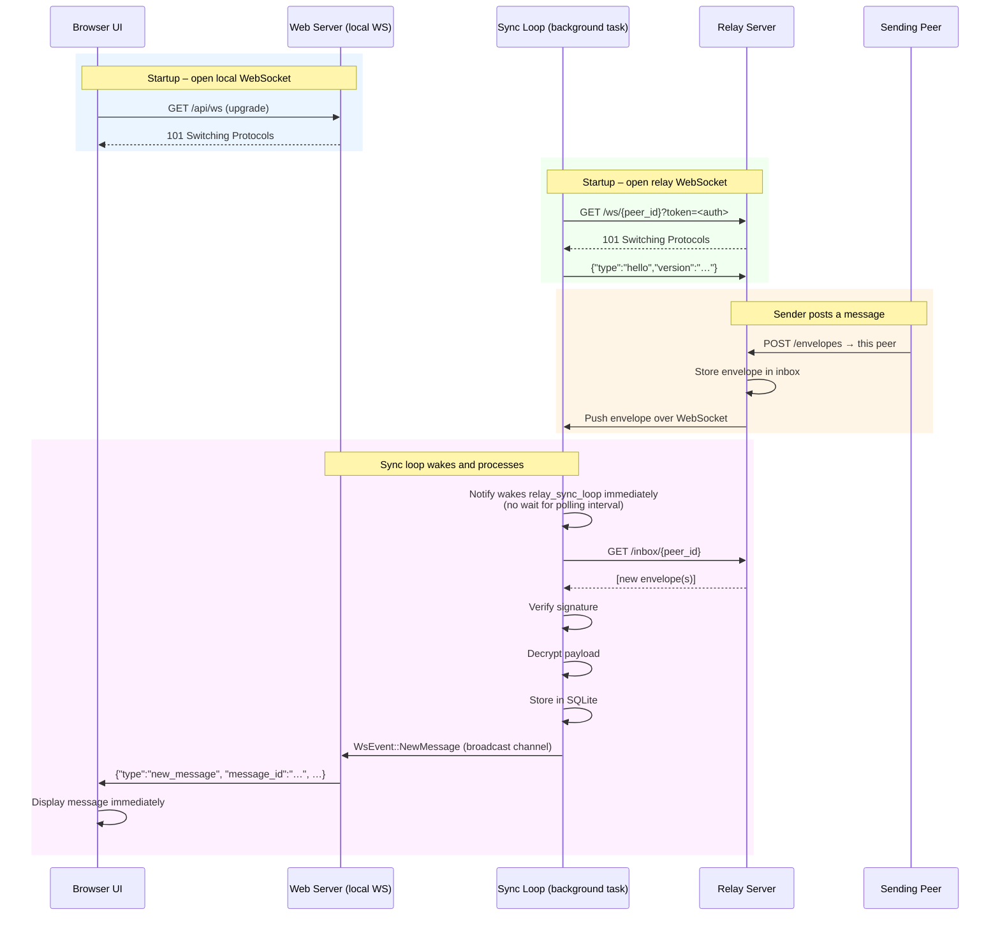
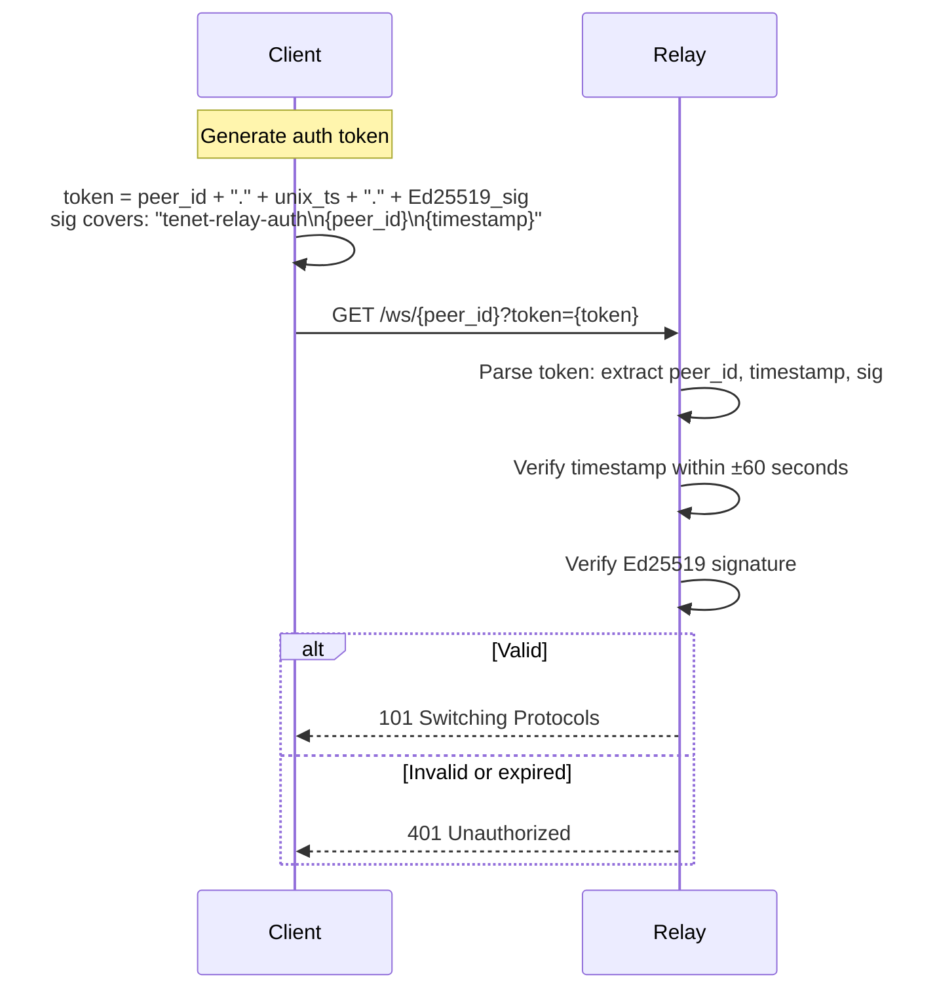
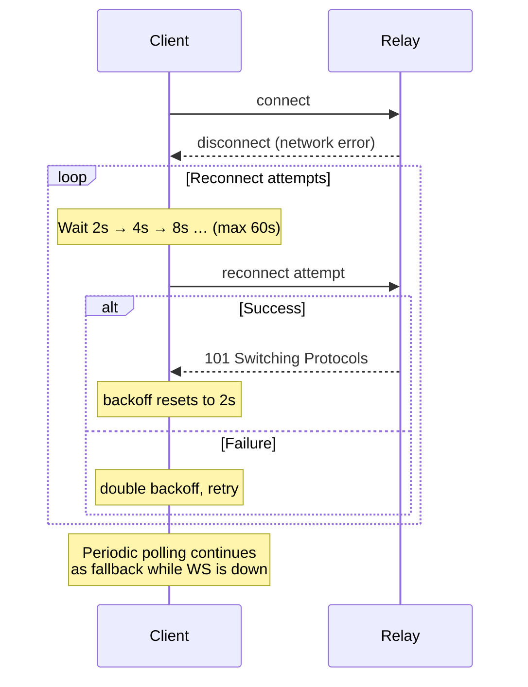

# Flow: Relay WebSocket Push

The relay exposes a WebSocket endpoint (`/ws/{recipient_id}`) that pushes
incoming envelopes to connected clients in real time. This eliminates polling
latency when a peer is actively online.

The web client opens **two** WebSocket connections:
1. **Relay WS** — to the relay server (`/ws/{peer_id}`), for real-time envelope push.
2. **Local WS** — to the web server (`/api/ws`), for UI updates (new messages, peer status, etc.).

## Connection and Push Flow

## Auth Token for Relay WebSocket

The relay WebSocket endpoint requires a short-lived authentication token to
prevent unauthorized inbox access.

## Reconnect with Backoff

If the relay WebSocket disconnects, the client reconnects with exponential
backoff (2 s, 4 s, 8 s … up to 60 s). Polling continues as a fallback during
the disconnected interval.

## WebSocket Events (Local UI Channel)

The web server broadcasts the following events to the browser over `/api/ws`:

| Event | Trigger |
|---|---|
| `new_message` | New message stored (any kind) |
| `message_read` | Message marked as read |
| `peer_online` | `MetaMessage::Online` received |
| `peer_offline` | Peer marked offline (timeout) |
| `friend_request_received` | Incoming friend request |
| `friend_request_accepted` | Outgoing request accepted |
| `group_invite_received` | Incoming group invite |
| `group_member_joined` | Member accepted group invite |
| `profile_updated` | Profile data received for a peer |
| `relay_status` | Relay connected / disconnected |
| `notification` | Any notifiable event |
